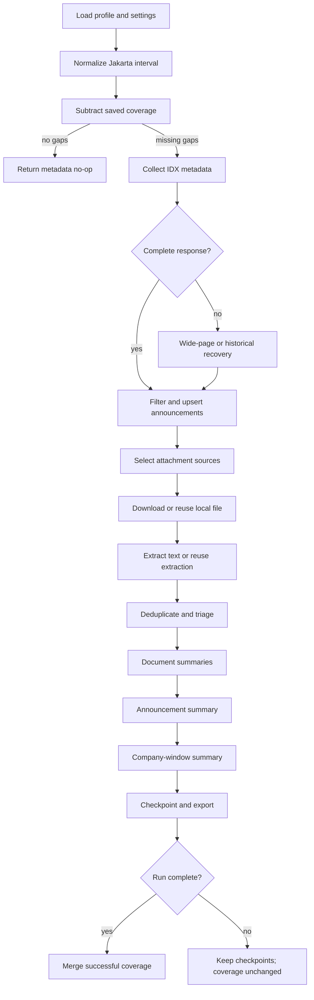

# How It Works

This document describes the current algorithm, durable state, cache boundaries, and recovery rules.

## Pipeline overview



## 1. Profile and interval normalization

Every CLI or GUI run resolves an isolated profile first. A profile has its own SQLite database, prompt configuration, browser state, runs, exports, and saved UI settings.

Start and end values are parsed in the configured application timezone, normally `Asia/Jakarta`. A date-only start means the beginning of that date; a date-only end means the end of that date. The pipeline keeps timezone-aware values at its boundaries.

Ticker input is normalized to uppercase. A blank ticker means all issuers in the selected instrument scope.

## 2. Coverage-aware incremental planning

Normal runs store normalized metadata coverage ranges per scope. The scope distinguishes at least listed-stock versus all-instrument retrieval and the optional ticker.

The requested interval is subtractively compared with saved coverage:

```text
missing_ranges = requested_range - normalized_saved_coverage
```

Only missing gaps are queried. Disjoint gaps are supported, so a backward gap and a forward gap can be collected in the same run. A full coverage hit returns a metadata no-op without downloads or model calls.

Historical audit deliberately bypasses subtraction and rechecks the entire requested interval.

Coverage never extends beyond the metadata poll-start snapshot. A run requesting a future end can only prove the interval that existed when polling began.

## 3. IDX metadata collection and completeness

The client requests announcement pages using calendar-day parameters and offset pagination. Each response is shape-checked and normalized. Space-padded issuer codes are trimmed.

When ordinary pagination is inconsistent, a bounded wide-page probe retries the shard from offset zero with a capacity large enough for the reported count, up to the configured maximum. A probe is accepted only when the returned rows satisfy the reported total.

Historical audit may fall back to paced per-ticker reconstruction using the stock master. Normal incremental gap filling does not enable that expensive fanout. If an incremental shard cannot be proved complete, the run remains partial.

Direct HTTP is attempted first in automatic transport mode. A protected response switches metadata or attachment access to the shared persistent Chromium session. Browser request-context and in-page transport choices are learned for the session to avoid repeating a known failing path.

## 4. Idempotent metadata storage

Announcements are deduplicated by their IDX identity before downstream work. Metadata and attachment rows are upserted into SQLite, so replaying an interval does not duplicate durable records.

Rows returned because IDX accepts calendar-day rather than exact-time filters are checked against the actual requested gap. Rows belonging to already-covered time are not treated as new work.

Keyword or maximum-announcement filters make a run unsuitable as general coverage evidence.

## 5. Attachment selection, download, and extraction

For ordinary disclosures, supported attachments are eligible for analysis. Financial-report announcements use a conservative primary-source selector:

- prefer the statement workbook;
- prefer the issuer's human-readable `LK` or `Laporan Keuangan` PDF;
- use a generic `FinancialStatement` PDF only as a fallback;
- exclude checklists, management statements, and XBRL/ZIP plumbing from model analysis.

Every selection decision remains stored for auditability.

The downloader reuses a cached local file when its durable attachment row points to an existing path. Otherwise it downloads the bytes, computes SHA-256, stores the content type and path, and checkpoints immediately.

Extraction is routed by file type:

- PDF: native text per page, then OCR only for sparse pages;
- XLSX/XLSM: primary financial sheets first, populated rows only, formula markers retained when cached values are absent;
- DOCX: paragraphs and tables;
- HTML: visible text;
- TXT: decoded text.

Browser I/O remains single-owner. Local extraction runs in a bounded worker pool with backpressure.

## 6. Evidence deduplication and routine triage

Attachments can be suppressed from model analysis only after local evidence exists. Exact normalized content and extremely similar same-format evidence are grouped conservatively. Workbook and PDF evidence are never near-deduplicated against each other because they can be complementary.

Routine shareholder-registration reports receive a deterministic evidence scan. Bounded, low-risk evidence can use one direct structured announcement request. Sparse, oversized, suspicious, or changed evidence uses the complete document-to-announcement path.

The decision, thresholds, detected signals, and representative source remain auditable.

## 7. Scheduling and provider safety

Independent work is submitted to a global scheduler. Capacity is bounded at several levels:

- global logical LLM jobs;
- active work per disclosure;
- active work per ticker;
- active HTTP requests at the provider;
- long-document chunks per document.

Weighted lanes prevent company reducers from starving document work while still allowing foreground work to overtake queued bulk chunks. Active requests are never preempted.

The provider gate reduces concurrency after rate limits or transient failures and gradually recovers after healthy responses. Network-looking failures pause new retries behind a connectivity watchdog rather than consuming all retry attempts during an outage.

## 8. Hierarchical summaries

The application does not append all raw market documents into one prompt.

1. A document summary is created from one attachment, or from ordered chunks followed by a combine request.
2. An announcement summary reduces only selected documents belonging to that announcement.
3. A company-window summary reduces only announcement summaries for one ticker and exact interval.

Company isolation is asserted before reduction. Source announcement IDs in claim provenance are filtered against the evidence actually supplied to the reducer.

When a company window contains exactly one valid announcement summary, it can be deterministically promoted into company schema without an additional model request.

## 9. Cache identity and invalidation

A parseable JSON object is not automatically a valid summary. Results are checked against strict schemas and required narrative fields before they can enter downstream work.

Document and reducer caches include the configured model and the relevant prompt/schema lineage. Changing a company prompt does not invalidate attachment extraction or document summaries. Changing a document prompt invalidates document summaries and dependent reducers while retaining local source files and extracted text.

Long-document chunk checkpoints include source identity, chunk position/count, content digest, model, and prompt version. Resume recomputes only missing or stale chunks.

Company-window fingerprints include the exact interval, ordered announcement evidence, prompt/schema lineage, model, and upstream summary content.

## 10. Durability, recovery, and output

Files, extracted text, summaries, audits, and run events are committed as soon as their stage succeeds. An interrupted process therefore leaves usable checkpoints.

Normal recovery choices are:

- resume the original run and reuse every current cache entry;
- export committed announcement summaries with `recover`;
- finish missing company reducers with `reduce-cached`;
- rebuild selected cached financial evidence with `refine-financials`.

Company exports and combined share files are written atomically, so readers do not observe a half-written artifact.

A company digest is stored under the exact `(ticker, start_at, end_at)` window that produced it, so an export selects whole saved windows rather than slicing into them. A picked date range therefore takes every saved window it overlaps, and a company that was reduced in several overlapping windows contributes its newest one unless every window is requested. The selected window boundaries are printed in the export, so the reader always sees which period each digest actually covers. No LLM call is made at any point.

## 11. Successful completion and coverage commit

Coverage is merged only after the applicable metadata gaps complete without errors and satisfy completeness checks. Partial runs retain all successful checkpoints but leave the unproven interval missing. The next run therefore retries the gap rather than silently skipping it.

The legacy high watermark remains diagnostic compatibility state. It is not treated as proof of an unknown historical start.

## Observability

The event stream records queueing, provider wait, generation, response, validation, retry, completion, extraction, cache, recovery, and coverage decisions. Terminal output intentionally shows current work and important warnings; detailed events remain in JSONL and Playwright traces.

Telemetry is advisory. It can recommend bounded next-run concurrency changes but does not change model output ceilings, prompts, analytical scope, or provider policy.
