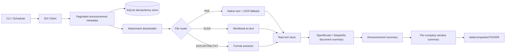

# IDX Disclosure Digest

A production-minded starter for scraping **Keterbukaan Informasi** from IDX, extracting attachment text, and producing isolated summaries per issuer through OpenRouter, pinned to DeepSeek V4 Flash 0731 on DeepInfra.

## Core behavior

- Fetches IDX announcements with pagination from `GetAnnouncement`.
- Supports an exact Jakarta-time window and either all issuers or one ticker.
- Trims IDX's space-padded `Kode_Emiten` values.
- Downloads PDF, XLSX, DOCX, HTML, and text attachments.
- Extracts native PDF text first, then uses Indonesian/English OCR for sparse scanned pages.
- Deduplicates announcements by `Id2` and attachments by URL plus SHA-256.
- Creates document summaries, announcement summaries, and a company-window digest.
- Never mixes one company's source records into another company's prompt.
- Exports each issuer under `data/companies/<TICKER>/`.

## Architecture



## Why the summaries are hierarchical

Do not repeatedly append every raw document into one ever-growing prompt. Store raw text permanently, summarize each attachment once, summarize the announcement from those attachment summaries, then build the selected company/window digest from announcement summaries. This is cheaper, easier to retry, and prevents context from becoming a swamp.

## Install

```bash
python -m venv .venv
source .venv/bin/activate
pip install -e .
cp .env.example .env
# Add OPENROUTER_API_KEY to .env
```

For OCR outside Docker, install Tesseract and the Indonesian language pack. On macOS:

```bash
brew install tesseract tesseract-lang
```


## Fast completeness recovery (v0.15.2)

v0.15.2 removes the common slow path exposed by busy IDX days. The announcement endpoint accepts `dateFrom`/`dateTo` at calendar-day granularity, so a true intra-day time-window split is not a reliable request primitive for this endpoint. Instead, when offset pagination is inconsistent and the reported shard can fit inside the configured recovery page, the client retries `indexFrom=0` once with a larger `pageSize` (default `200`).

For the observed case where IDX reports 183 disclosures on one day but a normal `pageSize=50` request exposes only the first 50, the recovery path becomes one `pageSize=200` probe rather than immediately checking every stock ticker. The response is accepted as complete only when the probe actually returns at least the reported number of rows. If the server still caps the response, or the reported shard is larger than the probe capacity, the paced stock-master per-ticker path remains a last-resort completeness fallback.

This release does not alter OpenRouter models, prompts, concurrency ceilings, or any LLM output-token limit.

## IDX throttle recovery (v0.15.1)

v0.15.1 separates IDX HTTP 429 throttling from browser-verification handling. It honors `Retry-After` when available, otherwise uses bounded exponential cooldown plus jitter, and paces the last-resort per-ticker completeness fallback with burst rests. The GUI surfaces `IDX RATE LIMITED` during cooldown. Install verification checks required prompt names instead of assuming a fixed prompt count.

## Incremental Intelligence & Recovery (v0.15.0)

v0.15.0 is cumulative over v0.14.4 and focuses on correctness, incremental reruns, recovery, and specialist evidence handling. **LLM generation ceilings are not reduced in this release.** Existing document/announcement/company output caps remain available exactly as before; performance gains come from avoiding redundant calls and better routing.

- **Pagination completeness guard:** an unexpected empty IDX page can no longer turn a partial metadata result into a successful run. The client falls back to daily date shards and, when necessary, per-stock ticker shards. Incomplete fallback shards make the run `partial` rather than silently claiming complete coverage.
- **Fingerprint company cache:** company-window summaries are keyed by exact window, ordered announcement evidence, announcement-summary content/model/prompt lineage, company prompt version, company schema version, and model. An unchanged rerun reuses the company digest with zero OpenRouter calls.
- **Dirty-company scope:** normal runs reduce only issuers discovered in the current metadata scope. Zero-evidence issuers are rejected before scheduler insertion.
- **Single-announcement promotion:** when a company window contains exactly one valid announcement summary, the validated announcement is deterministically promoted into company schema without another LLM call. `reduce-cached --force` still forces an LLM rebuild.
- **Progressive company results:** company checkpoints, company-cache hits, and deterministic promotions are surfaced to the GUI as soon as they are committed. The Company Digest no longer waits for the whole company queue to finish.
- **Phase-aware ETA:** live ETA accounts for the company-reducer tail after announcement processing has completed, and the company work ledger separates LLM rebuilds, cache hits, promotions, and no-evidence skips.
- **Network recovery watchdog:** transport-looking OpenRouter failures mark connectivity degraded, pause new provider retries behind a connectivity probe, and resume automatically when the network returns. Persisted running jobs are classified as interrupted after server restart; live worker death is reconciled defensively.
- **Concurrency guardrails:** the GUI adds Conservative, Balanced, and High-throughput presets plus warnings for configurations that let one disclosure occupy the entire global pool. Presets change concurrency only, never output-token ceilings.
- **Active vs next-run configuration:** the Desk displays a frozen Active Run strip while the left rail remains explicitly Next Run Settings. Editing the next form can no longer look like it changed a running request.
- **Public Expose specialist:** Paparan Publik, Public Expose, Investor Meeting/Presentation and pemaparan-kinerja documents remain full-pipeline disclosures, with a dedicated document prompt for guidance, targets, capex, capacity, utilization, project milestones, margins, funding and outlook.
- **Financial workbook ranking:** primary financial-statement sheets are emitted before taxonomy/XBRL plumbing. Formula cells with no cached value are preserved as `[FORMULA_NO_CACHED_VALUE ...]` rather than silently disappearing.
- **Routine ownership audit:** deterministic percentage-delta signals retain min/max percentages, absolute percentage-point delta, threshold, and evidence excerpt.
- **Stock-master guardrail:** stock-only runs can validate server-scoped announcements against a cached/refreshed IDX stock master. Suspiciously small master responses are rejected, stale but plausible cached masters are preferred over unsafe filtering, and historical non-stock company cards can be hidden without deleting their archived data.

## Fair Financial Hotfix (v0.14.4)

v0.14.4 is cumulative over v0.14.3. It fixes issues exposed by a real SRSN financial-report run without changing prompts, schemas, triage thresholds, or company isolation.

- **LKTT recognition:** financial-report smart selection treats standalone `LKTT` filenames as human-readable financial statements. With a workbook + `LKTT ...pdf` + generic `FinancialStatement...pdf`, the workbook and LKTT report are analyzed and the generic PDF is excluded as a duplicate representation.
- **Priority-yield provider gate:** long-document chunk requests are classified as bulk work. They may use all idle provider capacity, but once a normal document, announcement/company reducer, or combine request is waiting, newly released slots go to foreground work first. Active chunk requests are never preempted.
- **Truthful live counters:** the Work Ledger separates requests actually generating at the provider from requests waiting for provider/disclosure slots or validation. It no longer labels every request record as OpenRouter-active.
- **Clear chunk accounting:** long-document cards show completed, generating, and waiting chunks separately.
- **Request-class latency estimates:** large financial chunks learn their own p50/p90 history instead of being compared mainly with small document/reducer calls.

The provider ceiling and adaptive 429 backoff are unchanged. This patch improves fairness and observability; it does not raise concurrency.

## Long Document Engine (v0.14.3)

v0.14.3 is cumulative over v0.14.2 and can be installed directly over v0.10.0 or any later release. It targets the long-tail bottleneck exposed by large financial PDFs/XLSX files without changing source selection or analytical scope.

- **Exact chunk progress:** long documents emit a real `chunk X / N` plan, completed/active/remaining counters, and an explicit combine stage. The GUI labels this progress as exact rather than estimating a token percentage.
- **Bounded intra-document parallelism:** up to `LLM_DOCUMENT_CHUNK_CONCURRENCY` chunks can run concurrently (default 2), while actual HTTP requests still obey the global provider gate and the per-disclosure request cap.
- **Chunk checkpoints:** each successful chunk is saved immediately in SQLite using attachment URL, chunk index/count, SHA-256, model, and prompt version. Resume reuses valid chunks and recomputes only missing/stale chunks.
- **Retry visibility:** retries carry a reason (`malformed_json`, `rate_limited`, `timeout`, provider/structured-output error), chunk number, next attempt, and output budget into the event stream.
- **Straggler-aware ETA:** the Pipeline Observatory includes outstanding chunk/combine requests when estimating the tail of a run, preventing a nearly-finished counter from hiding one oversized financial document.
- **Conservative combine:** chunk results are kept in source order and only combined after every required chunk is validated or recovered from checkpoint.

The default remains conservative: 4 global slots, 2 per disclosure, and 2 chunks per long document. Increasing the chunk slider cannot bypass the global/provider/disclosure caps.

## Live Request Progress (v0.14.2)

v0.14.2 is cumulative over v0.14.1 and can be installed directly over v0.10.0 or any later release. It fixes the observability gap where the Pipeline Observatory could show active OpenRouter slots while the Live Work Ledger incorrectly appeared idle.

- **Correlated request lifecycle:** every OpenRouter completion gets a unique request ID and emits queued, provider-wait, sending, generating, response-received, validating, completed, or failed states.
- **Live OpenRouter cards:** the Work Ledger shows ticker/file/stage, elapsed time, attempt, prompt size, output cap, provider/model, provider-wait state, and current request phase.
- **Estimated latency progress:** non-streaming requests show a clearly labelled estimate based on recent schema-specific request latency or provider average. The bar is capped before completion and is never presented as an exact token percentage.
- **Exact pipeline counters:** the same ledger shows completed announcements and active/queued LLM work, eliminating the contradictory “No active workers” state while provider slots are occupied.
- **Streaming telemetry support:** when serial/raw streaming mode is used, lifecycle events also report received chunk and character counts.

The patch does not increase concurrency, change source selection, alter prompts, or bypass provider limits. Existing adaptive 429/transient-failure backoff remains unchanged.

## Responsive Hotfix (v0.14.1)

v0.14.1 is cumulative over v0.14.0 and can be installed directly over v0.10.0 or any later release. It changes presentation only. Long run IDs, URLs, JSON fields, audit records, and file paths can no longer expand the entire page beyond the viewport. Grid/flex children now have explicit shrink boundaries, Library ledgers use local horizontal scrollers when necessary, and modals size against their available container. Narrow layouts collapse progressively at 760 px and 520 px while preserving all existing controls and functions.

## Pipeline Observatory (v0.14.0)

v0.14.0 is Phase 4 of the throughput program. It is cumulative and can be installed directly over v0.10.0 or any later release. This phase does not add new source-skipping heuristics. It makes the pipeline measurable and turns completed-run telemetry into conservative next-run tuning advice.

- **Live Pipeline Observatory:** the Desk shows global LLM slot occupancy, adaptive provider gate pressure, extraction worker occupancy, LLM/extraction queue depth, rolling announcement throughput, ETA, and provider latency.
- **Scheduler telemetry:** run reports retain peak active slots, peak pending depth, queue wait, stage/ticker activity, and peak utilization.
- **Extraction telemetry:** reports retain peak inflight/backlog, backpressure events and wait time, queue wait, and utilization.
- **Provider telemetry:** reports retain success/failure counts, average/EWMA/max request latency, wait pressure, throttle events, final adaptive limit, and peak utilization.
- **Next-run tuning advisor:** after completion the report classifies the likely bottleneck as provider, extraction, LLM capacity, preparation/source, or balanced. It can suggest a bounded change to global LLM slots, extraction workers, or extraction backlog. The GUI button only applies those values to the next-run form.
- **Persistent performance report:** `last_run.json` includes a top-level `performance` object and the same data under `diagnostics.phase4_performance`, so the recommendation remains inspectable after the GUI closes.

Phase 4 never changes concurrency mid-run beyond the existing Phase 3 adaptive provider safety gate. This keeps benchmark conditions understandable and prevents the advisor from chasing its own moving target.

## Intelligence Triage (v0.13.0)

v0.13.0 is Phase 3 and is cumulative over Pipeline Engine I/II. It can be installed directly over v0.10.0, v0.11.0, or v0.12.0. The release reduces unnecessary LLM work while keeping conservative escape hatches.

- **Routine filing triage:** selected sources are still downloaded and extracted first. For `Laporan Bulanan Registrasi Pemegang Efek`, a deterministic scan checks control/ownership/director/free-float/treasury change indicators and evidence size. Low-risk bounded evidence is analyzed directly in one structured announcement call. Suspicious, sparse, failed, or oversized evidence uses the full document-summary → announcement reducer pipeline.
- **Safe post-extraction duplicate suppression:** exact duplicates and extremely similar same-format attachments are excluded from LLM analysis only after local evidence is available. XLSX and PDF are never near-deduplicated against each other, preserving complementary financial sources. The suppressed source, representative URL, category, and reason remain in SQLite and the ticker inspector.
- **Adaptive OpenRouter request gate:** the global LLM scheduler remains the logical job scheduler, while a provider-level gate controls actual concurrent HTTP requests. HTTP 429 halves the current provider limit; transient/5xx failures reduce it by one; healthy responses gradually ramp it back toward the user's configured global limit.
- **Audit visibility:** announcement summaries record `analysis_mode` (`full` or `routine_direct`) plus the deterministic triage decision. Activity logs include triage, dedup, and provider-gate events.

The GUI adds three profile-autosaved switches: **Adaptive provider slots**, **Routine filing triage**, and **Safe duplicate suppression**. Disable any one independently for A/B benchmarking.

Phase 3 deliberately does **not** skip download/extraction for routine reports, does not use filename-only duplicate rules, and does not treat a routine title as proof that a filing is immaterial.

## Pipeline Engine II (v0.12.0)

v0.12.0 is the Phase 2 throughput release and is cumulative: it can be installed directly over v0.10.0 without installing v0.11.0 first. It keeps the same analytical scope and adds orchestration/runtime efficiency only.

- **Adaptive IDX attachment transport:** after direct HTTP is challenged with 403 once, the downloader uses the shared Chromium session for the rest of the run. If Chromium request-context is also challenged but an in-page fetch succeeds, that session learns the in-page transport and skips the repeated failing request-context probe.
- **Bounded background extraction:** browser downloads remain single-owner, while local PDF/XLSX/DOCX/OCR extraction runs in a bounded worker pool. The queue applies backpressure instead of allowing an unbounded backlog.
- **Ticker-fair LLM scheduling:** fairness is now enforced by ticker as well as disclosure group, including a per-ticker active cap so one issuer with many announcements cannot occupy every global slot.
- **Weighted stage priority:** the global scheduler uses non-starving weighted lanes for document jobs, announcement reducers, and company reducers. Document jobs receive the largest share because they unlock downstream work.
- **GUI controls:** Desk exposes Extraction workers and Extraction backlog beside Global LLM slots and Per disclosure cap. Profile autosave stores all four values.

A practical starting configuration is `4` global LLM slots, `2` per disclosure, `3` extraction workers, and an extraction backlog of `8`. Browser/Playwright access remains single-owner.

## Pipeline Engine (v0.11.0)

v0.11.0 changes the normal scrape from a serial announcement pipeline into a fair market-wide LLM scheduler. IDX metadata pages are collected first. Browser-backed download/extraction stays single-owner and safe, while document summaries, announcement reducers, and later company reducers share a bounded global OpenRouter pool.

The GUI now exposes **Global LLM slots** and **Per disclosure cap**. A `4 / 2` configuration means at most four LLM requests run across the whole profile/run, while one announcement can occupy at most two slots. Every summary remains committed immediately to SQLite, and ticker isolation is checked at reducer boundaries.

## Current GUI workspace (v0.10.0)

v0.10.0 rebuilds **IDX Signal Desk** as a durable research workspace rather than a single-run dashboard. The visual language intentionally mixes a plain corporate filing page with modern navigation: serif masthead, navy document ink, purple/red links, horizontal rules, compact ledgers, responsive panels, and a paper/midnight theme. The page ships entirely from the local package and includes no analytics or external UI assets.

The primary views are **Desk**, **Library**, **Companies**, and **Activity**. Desk retains every existing run/recovery/refinement/share/audit capability. Library opens saved summary windows directly from SQLite, independent of the New Run date controls. Companies indexes every ticker with a saved digest. Activity reopens persisted `events.jsonl` streams and can package a run snapshot ZIP.

Research profiles are isolated workspaces. Existing `data/` automatically becomes **Main archive**. New profiles live under `data/profiles/<PROFILE_ID>/` with their own SQLite database, runs, prompts, browser profile, exports, and auto-saved form state. Creating a new profile never copies historical summaries or run streams; copying current form settings and prompts is optional.

The GUI auto-saves the active profile's run form, view, and theme. Run state and event streams are already persisted continuously by the backend.

## Modern local GUI and Prompt Studio (v0.3.8)

Version 0.3.7 introduced **IDX Signal Desk**, a responsive local web dashboard that uses the
existing pipeline, cache, SQLite database, browser fallback, and strict LLM schemas. Version
0.3.8 adds a first-class Prompt Studio and a corporate-action/expansion analysis profile. No
Node.js build is required and no secrets are sent to the browser.

Launch it from the project virtual environment:

```bash
idx-digest gui
```

The command opens `http://127.0.0.1:8787` and provides:

- exact Jakarta date/time controls, ticker and keyword filters;
- bounded document-summary concurrency from 1 to 8 workers;
- scrape-only, browser trace, and headless Chromium controls;
- live server-sent progress events without raw JSON or browser-asset spam;
- cache, announcement, task, and error counters;
- structured tabs for overview, timeline, financial figures, corporate actions, expansion,
  management changes, capital structure, listing/regulatory events, analytical scenarios, risks,
  monitoring, and raw JSON;
- a five-layer Prompt Studio with editable system, document, long-document merge, announcement,
  and company prompts;
- prompt profile names, per-layer hashes, reset-to-default controls, template variable references,
  and automatic cache invalidation;
- a slowdown chart plus direct downloads for the final report, prompts used, JSONL log, and
  Playwright trace.

Run without opening a browser automatically:

```bash
idx-digest gui --no-open-browser
```

Use a different local port:

```bash
idx-digest gui --port 8899
```

The GUI intentionally binds to `127.0.0.1` by default and has no built-in authentication.
Do not expose it to a public interface. The CLI remains fully supported for cron and automation.

### Editing prompts

Open the dashboard and select **Prompts** in the top bar. The editor contains five independent
layers:

1. **System guardrails** for factuality, prompt-injection resistance, and the distinction between
   facts, calculations, and hypotheses.
2. **Document analysis** for each PDF/XLSX/DOCX chunk.
3. **Long-document merge** for combining chunk summaries.
4. **Announcement reducer** for combining the main disclosure and its supporting attachments.
5. **Company-window digest** for combining announcements belonging to one ticker.

Prompts are stored locally at `data/prompts.json`. Each layer has a content hash. A document or
announcement cache entry is reused only when both its model and relevant prompt hash match. This
means changing the company prompt does not force PDFs to be downloaded or summarized again, while
changing the document prompt correctly rebuilds document and downstream announcement summaries.
Every GUI run stores the exact prompt bundle under `data/runs/<RUN_ID>/prompts.json`.

The default profile focuses on potential corporate actions and expansion. Its few-shot examples
cover management changes, bonus shares, free-float suspensions, business-direction changes,
conditional project investment, asset divestment, subsidiary formation, electric-bus capex, and
funding hypotheses. These examples are explicitly marked as classification guidance only and must
never be copied into an unrelated issuer.

The structured scenario output distinguishes:

- `explicit_fact`: directly disclosed by the source;
- `derived_calculation`: simple arithmetic from disclosed inputs, with basis and assumptions;
- `analyst_hypothesis`: an unconfirmed possibility, with confidence and caveats.

## Run one company in an exact time window

```bash
idx-digest run \
  --start '2026-08-05T21:00:00+07:00' \
  --end '2026-08-05T23:59:59+07:00' \
  --ticker ANTM
```

## Run all companies for whole dates

```bash
idx-digest run --start 2026-08-01 --end 2026-08-05
```

## Test without LLM cost

```bash
idx-digest run \
  --start 2026-08-05 \
  --end 2026-08-05 \
  --ticker ANTM \
  --skip-llm \
  --max-announcements 2
```

## Schedule it

Hourly incremental run with cron, covering the last two hours to tolerate delays and relying on deduplication:

```cron
5 * * * * cd /opt/idx-disclosure-digest && .venv/bin/idx-digest run --start "$(TZ=Asia/Jakarta date -d '2 hours ago' --iso-8601=seconds)" --end "$(TZ=Asia/Jakarta date --iso-8601=seconds)" >> data/cron.log 2>&1
```

For macOS, use launchd or a small wrapper because BSD `date` uses different flags.

## Output

```text
data/
├── idx_digest.sqlite3
├── last_run.json
├── prompts.json
├── runs/<RUN_ID>/prompts.json
├── raw/<TICKER>/<ANNOUNCEMENT_ID>/...
├── text/<TICKER>/<SHA256>.txt
└── companies/<TICKER>/
    ├── announcements.jsonl
    └── latest_window_summary.json
```

`announcements.jsonl` is regenerated deterministically from SQLite. Logically it is append-only, but reruns do not duplicate records.

## OpenRouter and DeepInfra configuration

The default configuration calls the exact DeepSeek V4 Flash 0731 model through OpenRouter and restricts execution to DeepInfra:

```env
OPENROUTER_API_KEY=sk-or-v1-...
OPENROUTER_BASE_URL=https://openrouter.ai/api/v1
OPENROUTER_MODEL=deepseek/deepseek-v4-flash-0731
OPENROUTER_PROVIDER=deepinfra
OPENROUTER_ALLOW_FALLBACKS=false
OPENROUTER_REQUIRE_PARAMETERS=true
```

Every chat-completion request includes:

```json
{
  "provider": {
    "only": ["deepinfra"],
    "allow_fallbacks": false,
    "require_parameters": true
  },
  "reasoning": {"enabled": false}
}
```

This deliberately fails when DeepInfra is unavailable or cannot honor JSON output. It does not silently route the disclosure text to another provider. To permit failover later, explicitly change the provider policy rather than relying on OpenRouter defaults.

Optional attribution headers can be set with `OPENROUTER_HTTP_REFERER` and `OPENROUTER_APP_TITLE`.

## Operational cautions

1. `GetAnnouncement` appears to be an IDX website backend endpoint, not a versioned public API. Keep response-shape validation and alerts because it may change.
2. Do not copy browser cookies into source code. `IDX_COOKIE` is an emergency runtime option only.
3. Use a descriptive user agent, conservative concurrency, retry/backoff, and a delay between index pages.
4. Treat attachment text as untrusted input. The system prompt explicitly ignores instructions embedded in documents.
5. OCR can be expensive. Native PDF extraction is attempted first, and OCR is only used on sparse pages.
6. The sample has both PDF and XLSX attachments, so downstream summaries should retain source filenames and extraction failures.

## Automatic Cloudflare-aware IDX session

Version 0.3 adds a browser-backed transport. It does **not** bypass CAPTCHAs.
It first tries the normal HTTP endpoint. If IDX returns HTTP 403 or an HTML
challenge page, it opens Chromium with a persistent profile and repeats the API
request inside the browser session.

Install Chromium once after installing the package:

```bash
playwright install chromium
```

Recommended `.env` settings:

```env
IDX_TRANSPORT=auto
IDX_BROWSER_PROFILE_DIR=./data/browser-profile
IDX_BROWSER_HEADLESS=false
IDX_BROWSER_VERIFICATION_TIMEOUT_SECONDS=180
```

Then run the same command:

```bash
idx-digest run \
  --start 2026-08-05 \
  --end 2026-08-05 \
  --ticker ANTM \
  --skip-llm \
  --max-announcements 2
```

On the first protected request, Chromium may appear. If IDX displays an
interactive verification, complete it in that window. The scraper keeps polling
and continues automatically after verification. The browser profile is retained
under `data/browser-profile`, so later runs normally reuse the session.

After a successful headed run, you can try:

```env
IDX_BROWSER_HEADLESS=true
```

If the session expires and headless mode starts failing, switch it back to
`false`, run once, and complete any verification shown by IDX.

Never commit the browser profile or `.env`. Both may contain sensitive session
state.

## Attachment 403 fallback (v0.3.1)

The browser-backed transport is shared by both the announcement API client and
attachment downloader. In `IDX_TRANSPORT=auto`, a direct PDF/XLSX download is
attempted first. If IDX returns HTTP 403, the downloader retries through the
same persistent Chromium context and cookie jar used for announcement metadata.
This fixes the case where announcement listing succeeds but `StaticData/...pdf`
or `.xlsx` downloads are still rejected.

After upgrading an existing editable installation, reinstall it:

```bash
pip install -e .
```

Then rerun the same `idx-digest run ...` command. Existing announcement rows are
safe to retry because storage is idempotent.

## Repairing empty summaries from v0.3.2

Version 0.3.2 accepted any parseable JSON object from the model. This meant malformed
responses such as `{}` or `{"": ""}` could be cached and exported as successful summaries.
Version 0.3.3 fixes this by:

- requesting strict OpenRouter `json_schema` structured outputs;
- validating required keys and non-empty narrative fields locally;
- retrying invalid model responses;
- automatically rebuilding invalid cached document summaries;
- excluding invalid cached announcement summaries from company digests;
- writing prompt versions `document-v2`, `announcement-v2`, and `company-window-v2`.

No database deletion is required. Re-run the same command and invalid cached summaries are
replaced automatically.

## Calm diagnostics and performance tracing (v0.3.6)

Version 0.3.6 replaces the noisy mixed terminal output with a calm live dashboard.
Diagnostic detail still exists, but chatty events are written to JSONL and the Playwright
trace instead of being painted over the terminal.

Run the normal diagnostic mode:

```bash
idx-digest run \
  --start 2026-08-05 \
  --end 2026-08-05 \
  --ticker ANTM \
  --max-announcements 2 \
  --diagnostics
```

`--diagnostics` now enables:

- millisecond Jakarta timestamps for major stages, retries, warnings, and errors;
- a temporary live dashboard that removes completed rows instead of leaving a wall of bars;
- a Playwright trace ZIP with screenshots, snapshots, and full network timing;
- a complete JSONL event log, including cache hits and per-page extraction details;
- first-token latency and LLM duration without printing raw model JSON;
- a five-entry slowdown report at the end.

It deliberately does **not** print every Nuxt script, font, image, cache hit, PDF page,
or streamed JSON token. Those details remain available in files:

```text
data/logs/idx-digest-<timestamp>.jsonl
data/traces/idx-browser-<timestamp>.zip
```

Open a browser trace with:

```bash
python -m playwright show-trace data/traces/idx-browser-*.zip
```

Use noisy details only when debugging a specific problem:

```bash
# Every browser request/response
idx-digest run ... --verbose --browser-network

# Individual cache hits
idx-digest run ... --verbose --cache-logs

# One line per extracted PDF page
idx-digest run ... --verbose --page-logs

# Raw model JSON. Progress is disabled automatically to prevent interleaving.
idx-digest run ... --stream-summary

# No live dashboard, useful for cron
idx-digest run ... --diagnostics --no-progress
```

The full JSONL log can be followed separately without cluttering the main terminal:

```bash
tail -f data/logs/idx-digest-*.jsonl
```

Browser traces and diagnostic logs may contain URLs, filenames, page snapshots, and
session-related browser state. Keep `data/logs/` and `data/traces/` out of public repositories.

## Parallel document summaries (v0.3.5)

Version 0.3.5 overlaps independent OpenRouter document-summary calls within each announcement.
Downloads, browser activity, and extraction remain serial because they share a synchronous persistent Chromium context. After text files are ready, uncached document summaries enter a bounded worker pool. The announcement summary starts only after that pool finishes, and the company summary still starts after announcement summaries are available.

Set the default in `.env`:

```env
LLM_CONCURRENCY=2
```

Override it for one run:

```bash
idx-digest run \
  --start 2026-08-05 \
  --end 2026-08-05 \
  --ticker ANTM \
  --max-announcements 2 \
  --llm-concurrency 2 \
  --diagnostics
```

The allowed range is 1 to 8. Start with 2. A value of 1 restores sequential behavior; 3 or 4 may be faster but can hit provider request-per-minute or token-per-minute limits.

Diagnostic logs include batch boundaries:

```text
[2026-08-06T19:20:01.123+07:00] INFO parallel: document summary batch started | documents=4 workers=2
[2026-08-06T19:20:32.491+07:00] INFO parallel: document summary batch finished | requested=4 completed=4 failed=0 workers=2
```

Raw document token streams are automatically disabled when more than one worker is active so concurrent JSON does not braid together in the terminal. Announcement and company-summary streams remain available.

## Terminal output policy (v0.3.6)

The terminal and diagnostic files now have separate jobs:

- **Terminal:** current stage, temporary progress, retries, errors, and slowest stages.
- **JSONL:** every structured event, including suppressed cache and page events.
- **Playwright trace:** detailed browser requests, responses, screenshots, and DOM snapshots.
- **Raw summary stream:** only when `--stream-summary` is explicitly requested.

This separation prevents Rich progress redraws from slicing through streamed JSON.

## Durable overnight runs and outage recovery (v0.3.9)

The GUI now persists every run under `data/runs/<run-id>/`. Closing the browser does not stop the scraper, and restarting the GUI restores completed/partial/interrupted run cards from disk. If the Python process or computer stops, the next GUI launch marks the run as interrupted and loads all committed announcement summaries.

Recover cached work without internet:

```bash
idx-digest recover --start 2026-08-06 --end 2026-08-06
```

The recovery export contains counts, per-company announcement summaries, and the exact original window. Resume from the GUI to finish missing work. Re-running the same window is safe because cache identity includes model and prompt hashes.

The GUI also has **Open cached checkpoints**. Set the same date window and ticker used by an interrupted older run, then click it to load stored company and announcement summaries without contacting IDX or OpenRouter.

## Finish cached company digests (v0.4.0)

When an interrupted run already has announcement summaries, do not scrape the market again. Reduce those checkpoints directly:

```bash
idx-digest reduce-cached \
  --start 2026-07-06 \
  --end 2026-08-06 \
  --llm-concurrency 3
```

The reducer is global across tickers. With three workers, three independent companies can be summarized at the same time, and the next company enters the first free lane. Existing company summaries for the exact window are skipped by default.

The reducer accepts legacy v0.3.7 announcement summaries, commits every finished company digest immediately to SQLite, exports it to `data/companies/<TICKER>/`, and can be rerun safely after a disconnect. It does not contact IDX or Chromium and does not repeat downloads, extraction, document summaries, or announcement summaries.

Use `--force` only to intentionally rebuild existing company-window summaries using the current model and company prompt:

```bash
idx-digest reduce-cached \
  --start 2026-07-06 \
  --end 2026-08-06 \
  --llm-concurrency 3 \
  --force
```

The GUI exposes the same path as **Finish cached company digests** below **Open cached checkpoints**.

## Copy or export every company (v0.4.1)

Saved company-window digests can now be appended into one friend-ready file without any new LLM call. In the GUI, click **Copy / export all** in the Company digest header. Choose **Friend-ready**, **Signals only**, **Everything**, or individual sections, then copy the text or download Markdown/TXT.

The renderer keeps ticker boundaries explicit and sorts companies alphabetically. It does not feed multiple companies back into OpenRouter, so company isolation is preserved.

CLI equivalent:

```bash
idx-digest export-all \
  --start 2026-07-06 \
  --end 2026-08-06 \
  --format md
```

For a shorter signal feed:

```bash
idx-digest export-all \
  --start 2026-07-06 \
  --end 2026-08-06 \
  --signals-only \
  --format txt
```

During normal company reduction and `reduce-cached`, v0.4.1 atomically refreshes:

```text
data/share/latest-all-companies.md
data/share/latest-all-companies.txt
```

after every successful company commit. That means an interrupted long run still leaves a current combined file containing every company that was safely committed before the interruption.

## Ticker inspector and provenance (v0.4.2)

Completed multi-company windows now have a dedicated ticker strip. Select a ticker and click **Inspect ticker** to open its audit trail:

- **Summary**: final structured digest and checkpoint metadata.
- **Process**: IDX announcement time, metadata save, download/extraction checkpoints, document/announcement/company summary times, plus exact LLM timing for v0.4.2+ calls.
- **Prompt → output**: exact stored system/user prompt and raw response for v0.4.2+ LLM calls. Older calls are explicitly marked reconstructed/not historically persisted.
- **Claims & sources**: claim-level source announcement mapping. New v0.4.2 company digests carry explicit `claim_sources`; historical summaries use deterministic/inferred attribution with the quality label shown.
- **Announcements**: announcement output, each main/supporting attachment, saved source file, extracted text, document summary, and located `source_evidence` with PDF page/line when available.

The audit records are local SQLite data under `data/idx_digest.sqlite3`. Exact prompts can contain extracted disclosure text, so the database should be treated as research material rather than a tiny cache.

## Smart financial-report sources (v0.4.3)

v0.4.3 adds a source-selection layer before attachment download and summarization. **Smart primary attachments** is enabled by default.

For `Penyampaian Laporan Keuangan ...` announcements, the pipeline analyzes the financial-statement workbook plus the actual LK/report PDF and excludes checklists, management/director statements, and XBRL ZIP packaging. Each keep/skip decision is stored in SQLite and shown in the ticker inspector.

Examples:

- PJAA: `FinancialStatement-2026-II-PJAA.xlsx` + `LK PJAA 30 Juni 2026.pdf`.
- ABDA: `FinancialStatement-2026-II-ABDA.xlsx` + `Laporan Keuangan TW II 2026 - ABDA.pdf`.

The improved XLSX reader trims formatted blank tails and labels extracted rows for source tracing.

To clean an existing cached window without contacting IDX:

```bash
idx-digest refine-financials \
  --start 2026-07-06 \
  --end 2026-08-06 \
  --ticker PJAA
```

Omit `--ticker` to refine every cached financial-report announcement in the window. The command reuses local attachments and text, refreshes selected financial document summaries, rebuilds affected announcement/company digests, and updates combined share exports.

New scrapes also default to **Listed stocks only**. CLI overrides:

```bash
--instrument-scope stocks|all
--attachment-policy smart|all_supported
```


## v0.4.4 hotfix

Financial-report smart selection now recovers attachment candidates from both cached announcement JSON and SQLite. It prefers the statement spreadsheet plus the issuer LK/report PDF, and treats generic FinancialStatement PDFs as fallback duplicates. Financial LLM chunks are smaller and malformed JSON retries gain output headroom plus a compact retry instruction.

Preview cached financial source selection without LLM calls using `idx-digest refine-financials --start ... --end ... --ticker PJAA --dry-run`.


## v0.15.3 incremental watermark mode

Normal `scrape` runs are now forward-moving by default. The active profile stores a metadata poll watermark in SQLite. If an existing archive is present but no watermark has been written yet, the newest stored announcement timestamp becomes the trusted baseline. The scraper then re-reads only a small overlap (default one day) through the requested end boundary, deduplicates already-complete announcement IDs, and processes only unseen or incomplete disclosures.

This means a window such as July 6 through August 10 does **not** re-audit every July date on every morning run. If the archive is already trusted through August 9, the effective IDX request begins around August 8 and continues forward. A successful run advances the watermark to the requested end boundary even when there were no new announcements. Failed/partial runs do not advance it. Announcements that exist in SQLite but do not have a valid current announcement summary are retried rather than skipped.

The expensive date-shard / stock-master ticker reconstruction remains available only when **Historical audit / backfill** is explicitly enabled in the GUI or `--historical-audit` is passed on the CLI. Incremental mode never fans a busy day out across the entire stock master; if a recent shard cannot be proven complete with normal pagination or the wide-page probe, the run stays partial and the watermark does not advance.

The default overlap can be adjusted with `IDX_INCREMENTAL_OVERLAP_DAYS` (default `1`). No OpenRouter generation ceilings were changed in v0.15.3.

## v0.15.4 true incremental boundary + profile deletion

Normal incremental runs now distinguish the last successful IDX poll boundary from the timestamp of the last announcement seen. A same-or-earlier requested end is an immediate no-op, while forward runs may query a small calendar overlap but discard rows at or before the trusted poll boundary before any download or LLM work. Empty profiles do not receive a watermark until their first complete run succeeds.

IDX completeness recovery is adaptive: the wide-page rescue starts at `IDX_WIDE_PAGE_PROBE_SIZE` (default 200) and can grow up to `IDX_WIDE_PAGE_PROBE_MAX_SIZE` (default 1000) when the server reports a busier shard such as 321 disclosures. Every probe is still verified against the reported total before being trusted.

The profile toolbar also provides **Delete profile** for non-Main profiles. Deletion is permanent, requires confirmation, is blocked during an active run, switches an active disposable profile back to Main, and removes only that profile's isolated local data tree. The Main archive remains protected.

Leaving the ticker field blank explicitly means **ALL listed companies**.

No OpenRouter output-token ceiling or model generation ability is reduced in v0.15.4.

## v0.15.5 coverage-aware incremental runs

v0.15.5 supersedes v0.15.4's end-only no-op rule. Each profile now stores normalized, scope-specific IDX metadata coverage ranges. A normal run subtracts those ranges from the exact requested interval, queries every missing gap, filters any covered rows returned by IDX's calendar-day API, and merges the new ranges only after the run completes without errors.

With saved coverage for August 7–9, requesting August 6–9 fetches only the backward gap, requesting August 7–10 fetches only the forward gap, and requesting August 6–10 fetches both edge gaps. Disjoint blocks are supported too: coverage for August 1–3 and August 5–9 causes an August 1–9 request to fetch only the missing interval around August 4. A metadata no-op occurs only when the entire requested interval is covered.

The legacy `scrape_watermarks` row remains available for compatibility and last-seen diagnostics, but its end timestamp is not treated as proof of an unknown start. During upgrade, completed non-no-op scrape reports are imported as coverage when they prove both boundaries. False v0.15.4 no-op reports, partial runs, keyword-filtered runs, capped runs, reducers, and refiners do not establish coverage. If an older archive has no trustworthy start evidence, the requested history is conservatively checked once.

Coverage also stops at the run's poll-start snapshot. If a run at 23:02 requests an end of 23:59, it records coverage only through 23:02 and leaves the remaining suffix deferred. A later same-day rerun automatically fetches 23:02 onward instead of incorrectly no-oping over disclosures that did not exist during the first poll.

Historical audit still forces a complete recheck of the requested interval and retains the expensive completeness fallback. Normal incremental gap filling does not enable stock-master fanout. No OpenRouter model, output-token ceiling, prompt schema, or generation capability is reduced in v0.15.5.
